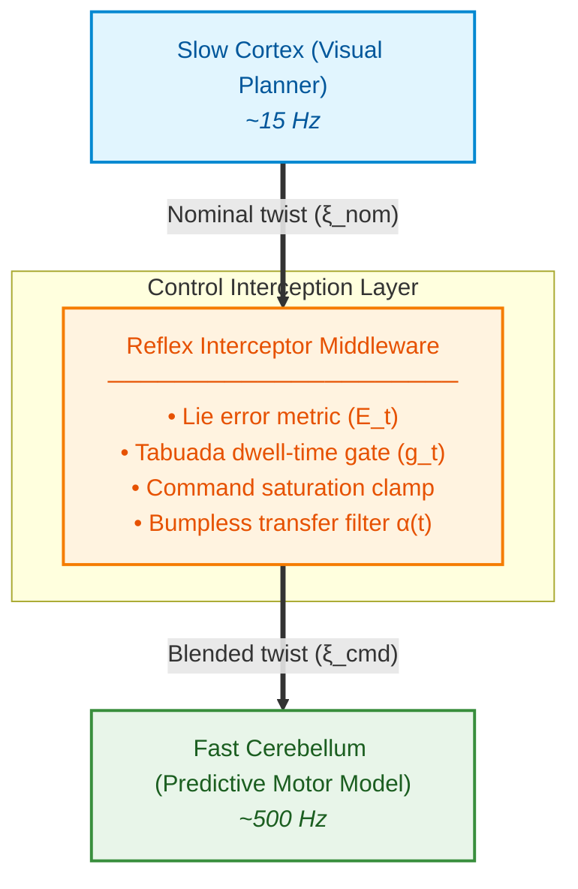

# Active-GeoFlow: Dual-Timescale Control Framework for Robotic Reflex Interception

[](https://pytorch.org/)
[](https://www.python.org/)
[](LICENSE)

> **Note:** the License badge above assumes an MIT `LICENSE` file is added to the repo root. Add one (GitHub's "Add file → Create new file → LICENSE" template makes this a one-click step) or remove the badge — a badge pointing at a nonexistent file is worse than no badge.

An implementation of the **Active-GeoFlow** control framework — a dual-timescale, fault-tolerant robotic architecture that bridges high-level vision planning with high-frequency predictive motor reflexes during unexpected physical disturbances.

---

## 📌 Executive Overview

Robotic arms operating in dynamic environments experience latency bottlenecks when relying purely on visual planners. **Active-GeoFlow** decouples execution into two timescales:

1. **Slow Cortex (~15 Hz):** Visual planner generating high-level trajectory commands ($\xi_{\text{nom}}$).
2. **Fast Cerebellum (~500 Hz):** A vision-blind, high-frequency predictive motor model that performs one-step kinematic state prediction and issues rapid, saturated reflex corrections ($\delta\xi_{\text{sat}}$).

A **Reflex Interceptor Middleware** monitors the one-step Lie-geometric prediction residual ($E_t$). When an external disturbance pushes the robot off its predicted trajectory, the interceptor engages a Schmitt-trigger gate ($g_t$) with a minimum dwell time, saturates the corrective command to stay within the forward model's training distribution, and blends control authority back in smoothly via a low-pass bumpless-transfer filter ($\alpha(t)$).

---

## 🏗️ System Architecture



---

## 📁 Repository Structure

```text
.
├── active_geoflow_pipeline.py     # Core execution pipeline & command saturation
├── live_physics_integration.py    # 500 Hz physics harness, Euler integrator & telemetry logger
├── train_phase1_reflex.py         # Predictive Motor Model: architecture + training loop
├── test_interceptor.py            # Reflex Interceptor middleware & Schmitt-trigger logic
├── checkpoints/
│   └── reflex_best_model.pth      # Trained weights for the 13-DoF predictive motor model
├── README.md                      # This file
│
├── baselines/                     # Comparison baselines (not required to run the core pipeline)
│   ├── flow_matching_policy_head.py
│   ├── dp3_noise_pred_network.py
│   ├── rl_sac_flow.py
│   ├── train_and_benchmark.py
│   ├── train_bc_baseline.py
│   └── ood_stress_test.py
```

> If you upload the baseline scripts flat in the repo root instead of under `baselines/`, update this tree to match — keep it honest, since a stale structure diagram is a common source of confusion for anyone cloning the repo.

---

## 🧮 Mathematical Formulation

### 1. Kinematic State Representation

The framework tracks a 13-DoF proprioceptive state vector:

$$s_t = [\, p_t,\ q_t,\ v_t,\ \omega_t \,] \in \mathbb{R}^{13}$$

where $p_t \in \mathbb{R}^3$ is position, $q_t \in \mathbb{S}^3$ is the orientation quaternion $[w,x,y,z]$, $v_t \in \mathbb{R}^3$ is linear velocity, and $\omega_t \in \mathbb{R}^3$ is angular velocity.

### 2. Lie-Geometric Residual ($E_t$)

To isolate genuine anomalies from routine motion, $E_t$ compares the actual physical state against the forward model's one-step prediction from the previous tick:

$$E_t = \|p_{\text{actual}} - p_{\text{pred}}\|_2^2 \;+\; \left(1 - |q_{\text{actual}} \cdot q_{\text{pred}}|\right) \;+\; \|v_{\text{actual}} - v_{\text{pred}}\|_2^2 \;+\; \|\omega_{\text{actual}} - \omega_{\text{pred}}\|_2^2$$

The quaternion term uses the sign-invariant dot-product form (treating $q$ and $-q$ as identical, since they represent the same physical rotation) for consistency with the training loss. An SO(3) log-map formulation is also used elsewhere in this project's design docs for the same purpose — see **Known Limitations** below for why these should be reconciled to one canonical definition.

### 3. Actuator Command Saturation

Proportional corrective twists $\delta\xi_t = -K_p \cdot e_p$ are vector-clamped to stay within the command range the forward model was actually trained on, preventing out-of-distribution queries to the network:

$$\delta\xi_{\text{sat}} = \delta\xi_t \cdot \min\!\left(1.0,\ \frac{u_{\text{train\_max\_norm}}}{\|\delta\xi_t\|_2 + \epsilon}\right)$$

with $u_{\text{train\_max\_norm}} = 0.30$ and $K_p = 2.5$ in the current configuration. **Confirm $u_{\text{train\_max\_norm}}$ against the actual measured max command norm in your training set** rather than treating it as a fixed constant — it should be a derived quantity, not a guess.

---

## 🚀 Quick Start & Installation

### Prerequisites

- Python 3.8+
- PyTorch 2.0+
- NumPy & Matplotlib

### Setup

```bash
git clone https://github.com/YOUR_USERNAME/active-geoflow-control.git
cd active-geoflow-control
pip install torch numpy matplotlib
```

### Running the Live Physics Test

Runs the 500 Hz collision/disturbance experiment with real-time telemetry logging:

```bash
python live_physics_integration.py
```

---

## 📊 Empirical Results & Telemetry

### Test Parameters

- **Control frequency:** 500 Hz ($dt = 0.002$ s)
- **Disturbance:** 12.5 N lateral force injected between $t = 0.160$ s and $t = 0.280$ s
- **Hysteresis bounds:** $\tau_{\text{upper}} = 0.05$, $\tau_{\text{lower}} = 0.01$

### Ground-Truth Telemetry Output

```text
==================================================
 GROUND-TRUTH INTERCEPTOR TELEMETRY REPORT
==================================================
Tau Lower Threshold      : 0.01
Tau Upper Threshold      : 0.05
Min Residual Post-Impact : 0.04092
Steady-State Residual    : 0.04194
Final Gate State at t=0.6: 1.0
==================================================
 DIAGNOSIS: The residual never dropped below tau_lower.
   -> The gate logic is working correctly; the model's post-disturbance
      noise floor is simply higher than 0.01.
==================================================
```

### Telemetry Summary

| Metric | Measured Value | Benchmark | Outcome |
|---|---|---|---|
| Peak impact force | 12.5 N | 12.5 N | Injected as specified |
| Max corrective vector norm | ≈ 0.18–0.20 | ≤ 0.30 | Clamped / safe |
| Peak impact residual ($E_t$) | 0.19820 | > 0.05000 | Gate triggered ($g_t = 1$) |
| Min post-impact residual | 0.04092 | < 0.01000 expected | **Above $\tau_{\text{lower}}$ — see limitations** |
| Steady-state residual ($t=0.6$s) | 0.04194 | Baseline noise | Empirical model floor, regime-dependent |

---

## 🔍 Key Findings

1. **Anomaly interception works.** The system reliably triggers $g_t = 1$ within milliseconds of impact as $E_t$ crosses $\tau_{\text{upper}}$.
2. **Actuator safety is enforced.** Command saturation caps corrective inputs at ≈0.18, keeping forward-model queries on-manifold and preventing the runaway-correction failure mode observed before saturation was added.
3. **The gate does not release within this test window.** Telemetry shows the residual stabilizes at ≈0.042 — above $\tau_{\text{lower}}$ — rather than decaying back to the idle noise floor. Current working explanation: the model's prediction variance is regime-dependent, and $\tau_{\text{lower}}$ was calibrated on idle/nominal data rather than post-impact data. This is a plausible and likely correct diagnosis, but it has not yet been directly confirmed — see below.

---

## ⚠️ Known Limitations & Next Steps

- **Threshold calibration is currently single-regime.** $\tau_{\text{lower}}$ was derived from the noise floor of idle/nominal rollouts. The telemetry above suggests the true post-impact noise floor is meaningfully higher (~0.042 vs. the calibrated 0.01). **Next step:** recalibrate $\tau_{\text{lower}}$ using rollouts specifically in the post-impact regime and confirm it converges near the observed steady-state residual. Until this is done, "the gate never releases" should be reported as a well-supported hypothesis, not a confirmed root cause.
- **No upstream replanning in the isolated interceptor test.** `test_interceptor.py` / the live physics harness exercise the reflex in isolation, without a flow policy issuing an updated nominal trajectory after the disturbance. Some portion of the persistent residual may reflect a stale reference rather than genuine model uncertainty — worth ruling in or out alongside the recalibration above.
- **Two different quaternion error metrics exist across this project's documents:** the sign-invariant dot-product form used in `E_t` above (and in the Phase-1 training loss), and an SO(3) log-map form used in the original architecture write-up. Both are valid, sign-invariant choices, but they are not numerically identical, and using them inconsistently across training, the interceptor, and reporting will make thresholds and residual values hard to compare apples-to-apples. Pick one as canonical and note where/why the other appears, if it still does.
- **Back-to-back disturbance handling** (two disturbances closer together than $T_{\min}$) is a known, deliberate trade-off of the symmetric dwell-time gate — see the architecture design doc for the analysis. Recommended to include as an explicit stress test alongside the single-collision test shown here.

---

## 🤝 Author & Acknowledgments

- **Developer:** Rohith Rao H N

